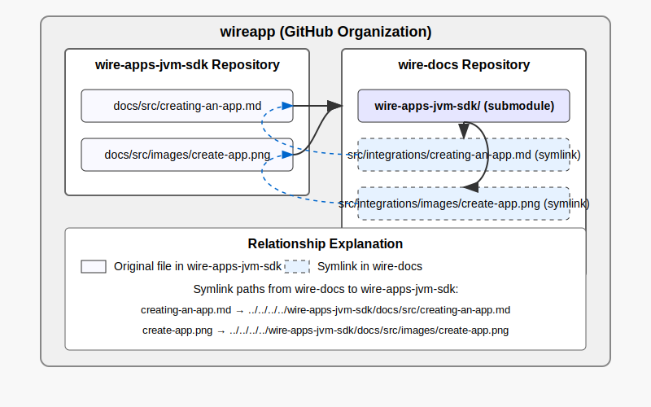
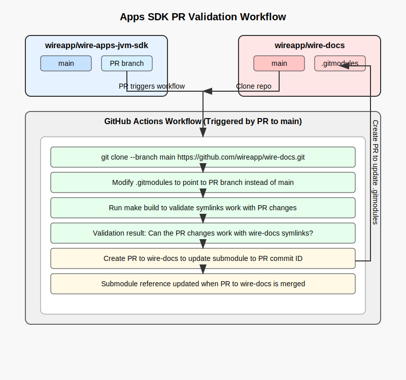

# /docs 

- These files are included in the `wire-docs` repository as a submodule and are pulled during the build process. They are essential for constructing the complete Wire documentation site. Any changes to these files should be made here, while updates to the older files (not present here anymore) should be committed directly to the `wire-docs` repository.



- The Markdown (.md) pages in this directory should be self-contained, including any static images or diagrams. However, please note that links within these documents may not function correctly, as they are relative to the `wireapp/wire-docs/src` directory. To ensure that document links work as intended, collaborate with the `wire-docs` repository to identify their correct locations.

- [build workflow](../.github/workflows/build.yaml):
    - This workflow automates documentation validation between the `wire-apps-jvm-sdk` and `wire-docs` repositories. 
    
    - When a PR is made to `wire-apps-jvm-sdk`'s main branch, GitHub Actions clones `wire-docs` and temporarily modifies its .gitmodules to point to the PR branch instead of develop. It then runs a build process to validate that the documentation changes work correctly with `wire-docs` symlink structure.

    -  If validation passes, the workflow creates a second PR to `wire-docs` that updates the submodule reference to point to the specific commit ID from the original PR. 
    
    - This dual-PR approach ensures that documentation changes are fully tested before being merged and maintains version stability by pinpointing exact commits rather than following branches.



# Documentation Management for Wire

## Understanding the Repository Structure
- **wire-docs**: Main documentation repository
- **wire-apps-jvm-sdk/docs**: Documentation related to the code in the `wire-apps-jvm-sdk` repository

## Update Operations

### Editing Existing Pages

**For content in wire-apps-jvm-sdk/docs:**
1. Make changes directly in the `wire-apps-jvm-sdk/docs` directory
2. Create a PR against the `wire-apps-jvm-sdk:main` branch
3. Once merged, these changes will be picked up by `wire-docs` through submodule updates

**For content only in wire-docs:**
1. Make changes directly in `wire-docs/src`
2. Create a PR against `wire-docs:main` branch

### Moving Pages from wire-docs/src to wire-apps-jvm-sdk/docs

When a page needs to be moved because it's related to code changes:
1. Add the page to `wire-apps-jvm-sdk/docs` and merge it to the main branch
2. In `wire-docs`:
   - Update the `wire-apps-jvm-sdk` submodule to the latest commit
   - Delete the original page from `wire-docs/src`
   - Create a relative symbolic link to the file in the `wire-apps-jvm-sdk` module:
     ```
     cd src/integrations/
     rm creating-an-app.md
     ln -s ../../wire-apps-jvm-sdk/docs/src/creating-an-app.md creating-an-app.md
     ```
3. Test with `make run` before creating a PR

## Creating New Files

### For content related to wire-apps-jvm-sdk:
1. Create the file in `wire-apps-jvm-sdk/docs`
2. Merge it into `wire-apps-jvm-sdk:main`
3. To make it discoverable on docs.wire.com:
   - Update the navigation structure in [mkdocs.yml](https://github.com/wireapp/wire-docs/blob/main/mkdocs.yml#L9) or update the directory's README.md to include references to the new file, or add references to the new file from relevant existing pages
   - Update the `wire-apps-jvm-sdk` submodule reference in `wire-docs` if not done automatically
   - Add references to the new file from relevant existing pages
   - Test with `make run` and create a PR to `wire-docs:main`

### For content not related to wire-apps-jvm-sdk:
1. Add the page to `wire-docs/src` in the appropriate location
2. Update the navigation structure in [mkdocs.yml](https://github.com/wireapp/wire-docs/blob/main/mkdocs.yml#L9) or update the directory's README.md to include references to the new file, or add references to the new file from relevant existing pages 
3. Test with `make run` and create a PR to `wire-docs:main`

## Removing Files

### Removing files from wire-apps-jvm-sdk/docs:
1. Identify all references to the file in `wire-apps-jvm-sdk/docs` and `wire-docs`
2. Remove all references and links from navigation (mkdocs.yml) and other pages
3. Delete the file from its location
4. Submit a PR to `wire-apps-jvm-sdk:main`

### Removing files from wire-docs:
1. Identify all references to the file in `wire-docs` and `wire-apps-jvm-sdk/docs`
2. Remove all references and links from navigation (mkdocs.yml) and other pages
3. Delete the file from its location
4. Submit a PR to `wire-docs:main`

## Publishing Changes

All changes to documentation go live when the [CI Build](https://github.com/wireapp/wire-docs/blob/main/.github/workflows/build.yaml) workflow on `wire-docs` runs. Currently, submodule updates from `wire-apps-jvm-sdk` to `wire-docs` are performed manually, but there are plans to automate this with a pipeline.
