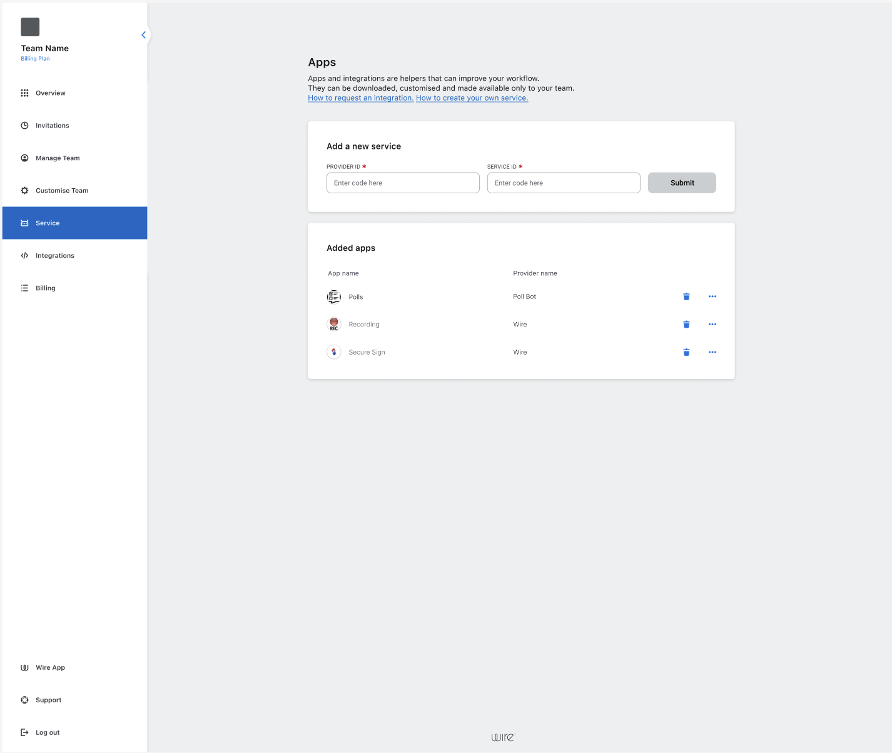

# Creating an App

Creating an App is simple and only takes a few minutes.

---

## 1. Open the Team Settings Dashboard
Go to Team Settings Dashboard and navigate to **Apps → Create New App**.

---

## 2. Choose a Name
Pick a clear, descriptive name for your app.
Example: `SupportBot`, `Daily Standup Assistant`.

---

## 3. Configure Permissions
Apps require **permissions** (also called security scopes).  
These define what your app can do.

| Permission    | Common Use                           |
|---------------|--------------------------------------|
| `ALL`         | Can do everything a normal User can. |
| `READ/WRITE`  | Utility Apps.                        |
| `WRITE`       | Write only Apps.                     |

To learn more about permissions, [click here](./permissions.md)

---

## 4. Generate an App Token
Once created, your app will have a **unique token** used to authenticate requests.

> 🔒 Treat tokens like passwords — never share them publicly.
