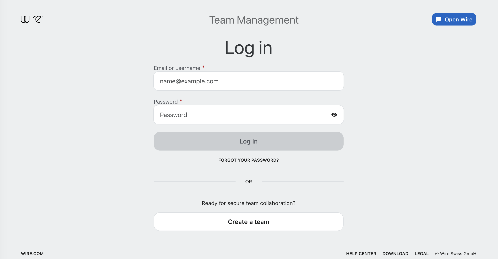
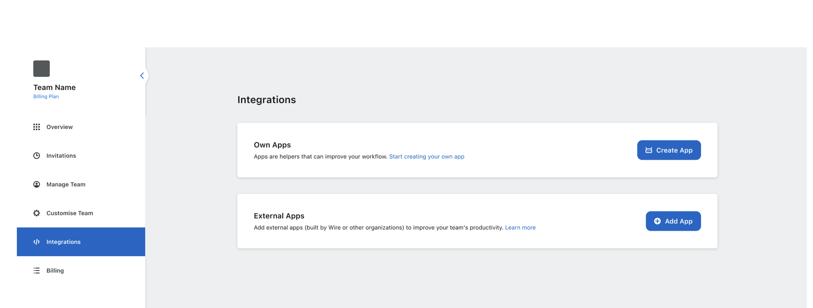
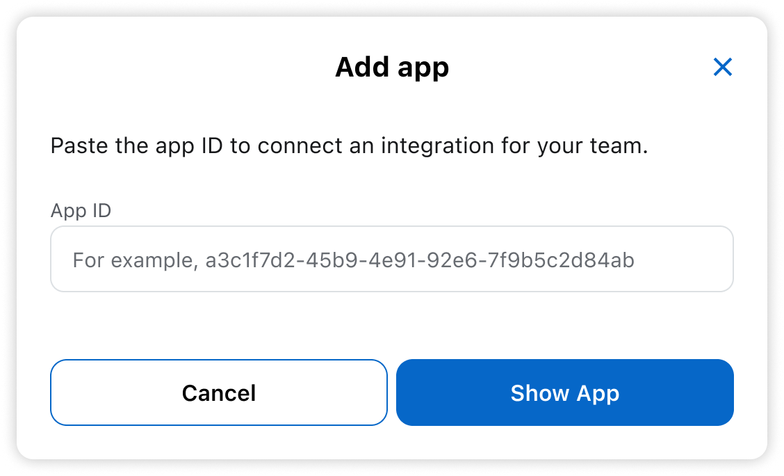
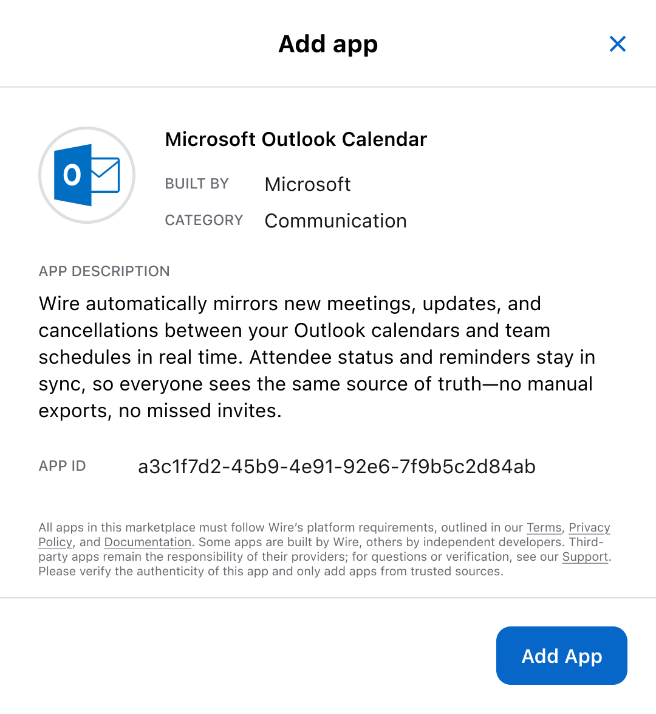

# Add external App

You’ve found an app built with the Wire Integration SDK by another team,
or discovered Wire-developed apps in the [showcase]().  
The App ID is required for the following steps.

## On desktop (macOS, Windows, or on Wire for web)

In the app:

1. Select *Settings*, then select *Manage team* or go to [teams.wire.com](https://teams.wire.com/).
2. Log in with your account credentials:

3. Select *Integrations*.

4. Select *Add App*.

5. Enter the app ID.

6. Review the app details.

:::tip
Only add apps from trusted sources.
:::
