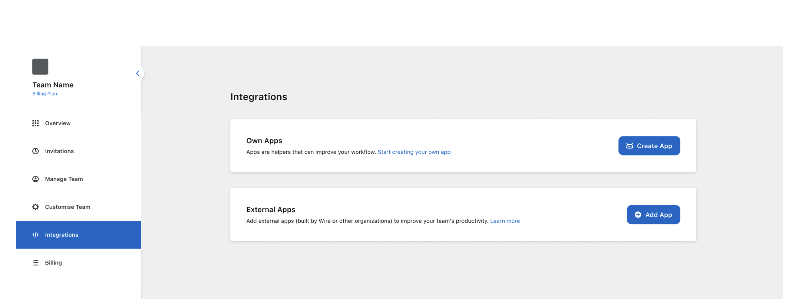

# Create App

Apps are available on paid plans.
Upgrade to unlock integrations that simplify workflows and connect Wire to your existing tools. 
[See plans and pricing](https://wire.com/pricing).

## On desktop (macOS, Windows, or on Wire for web)

In the app:

1. Select *Settings*, then select *Manage team* or go to [teams.wire.com](https://teams.wire.com/).
2. Log in with your account credentials:

3. Select *Integrations*.

4. Select *Create App*.

|  |  |
|---------------------------------------------------------|-------------------------------------------------------------------|

5. Add your App details.

6. You’ll see the token once. 
    Save it now, then set it as the `APP_TOKEN` environmental variable.   
   **You won’t be able to view it again.**

7. After the app is created, you’ll return to the Integrations tab.  
   Select the three dots next to your app, then choose *View details* to find the rest of your credentials: **App ID**, **host**, and **domain**.

## What’s next
Now that you have the credentials, you’re ready to connect your app.
Go to [Quickstart](../quickstart/#2-include-the-sdk-into-your-project) to include the SDK in your project and continue setup.
