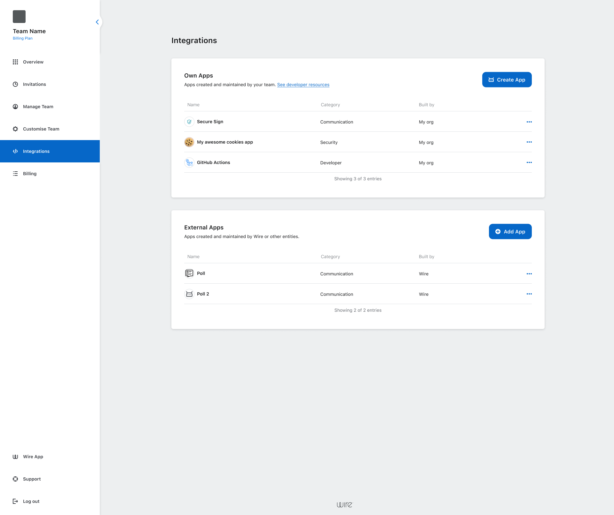
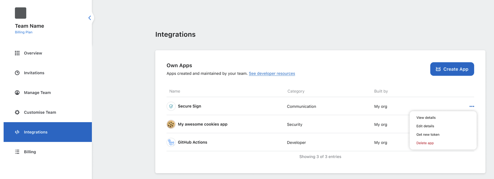
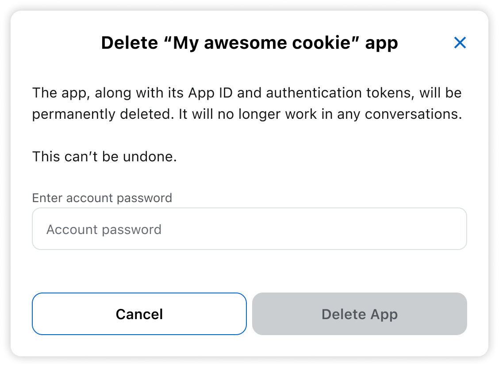

# Delete internal App

Delete an app that your team owns and no longer needs.  

Deleting an app is permanent. 
It invalidates the app’s credentials and cannot be undone and stops it from working on any team where it was shared.

> Looking to remove an external app from your team instead? [Follow these steps](remove-external-app.md).

## On desktop (macOS, Windows, or on Wire for web)

In the app:

1. Select *Settings*, then select *Manage team* or go to [teams.wire.com](https://teams.wire.com/).
2. Log in with your account credentials:

3. Select *Integrations*.

4. Select the three dots (•••) next to app name.

5. Select *Delete app*.

6. Enter your password.

:::danger  
Deleting an app is permanent. 
The App ID and authentication token will be invalidated for **all teams** using the app and cannot be restored.  
To continue using the integration, you’ll need to [create a new app](create-app.md)
and update your code with the new credentials, and share the new App ID with any teams that need it.  
:::
