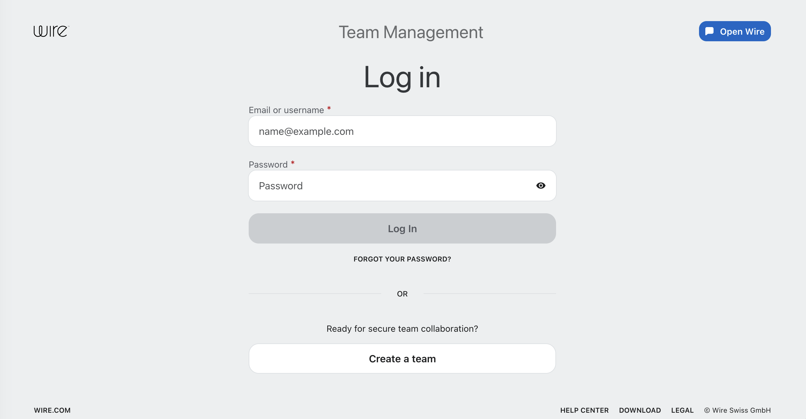
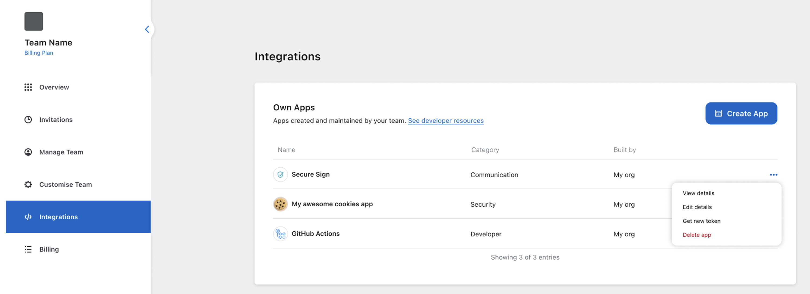

# Edit App

You can update your app’s logo, name, category, or description at any time.

## On desktop (macOS, Windows, or on Wire for web)

In the app:

1. Select *Settings*, then select *Manage team* or go to [teams.wire.com](https://teams.wire.com/).
2. Log in with your account credentials:

3. Select *Integrations*.

4. Select the three dots (•••) next to app name.

5. Choose *Edit details*.

6. Update the fields as needed, then select *Save*.

## About authentication token editing

You cannot edit or retrieve the authentication token because it’s securely generated for your app.
If you need a new token, [regenerate it](./regenerate-auth-token.md).
