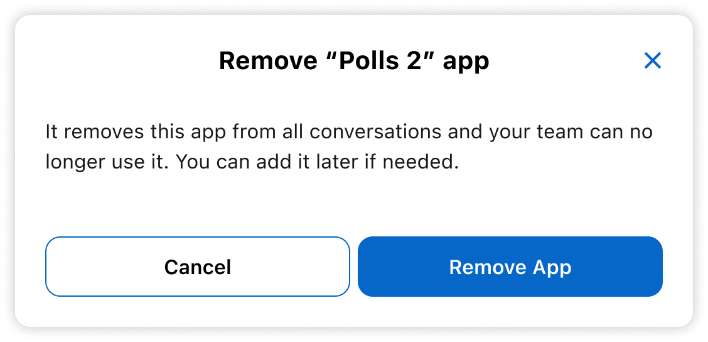

# Remove external App

Stop using an external app that was added to your team.

Removing an app disconnects it from **your team only**. Other teams using the app aren’t affected.

> Looking to delete an app your team owns instead? [See how to delete an internal app](delete-app.md).

## On desktop (macOS, Windows, or on Wire for web)

In the app:

1. Select *Settings*, then select *Manage team* or go to [teams.wire.com](https://teams.wire.com/).
2. Log in with your account credentials:

3. Select *Integrations*.

4. In the *External Apps* section, select the three dots (•••) next to app name.

5. Select *Remove app*.

The app will be removed from your team. It won’t appear in your integrations list anymore, but other teams using the app won’t be affected.
