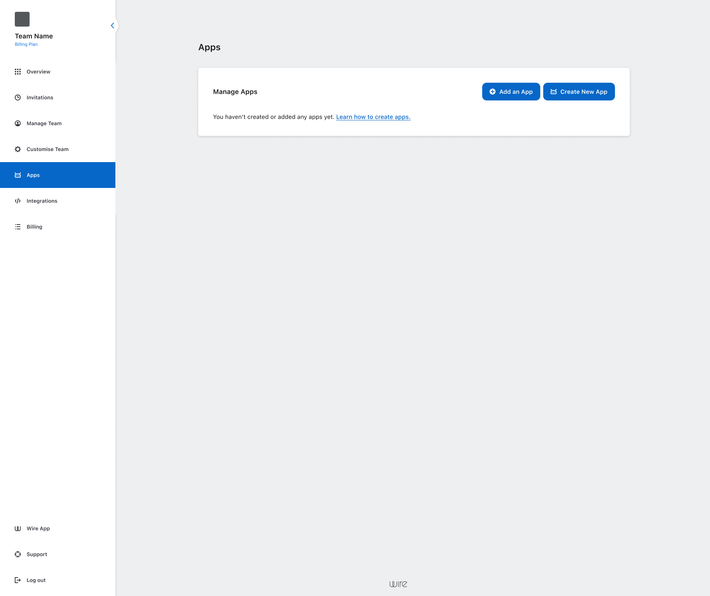
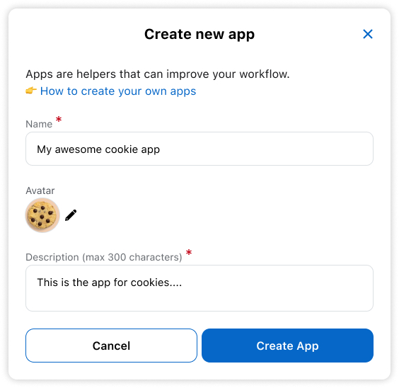
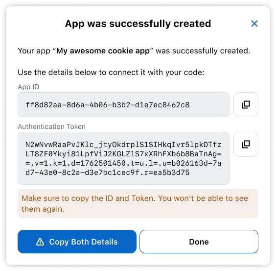

# Quickstart

In this guide you will create a basic App that can echo to received messages.

---

## 1. Creating an App

- Access Team Settings Dashboard and navigate to **Apps**
- Click **Create New App** button



## 2. Fill in the details

- Add your App's name, avatar and description
- Click **Create App**



## 3. Copy App ID and Token

When your App is created, an App ID and a Token will be generated.
Copy and save them with caution as the Token cannot be retrieved after the dialog closes.



## 4. Include the SDK into your project

The inclusion of the SDK can be made via Maven or Gradle

### Gradle

```kotlin
dependencies {
    implementation("com.wire:wire-apps-jvm-sdk:0.0.1")
}
```

### Maven
```xml
<dependency>
    <groupId>com.wire</groupId>
    <artifactId>wire-apps-jvm-sdk</artifactId>
    <version>0.0.1</version>
</dependency>
```

## 5. Initiate the SDK

### Handling Events

The SDK uses the `WireEventsHandler` to notify your application about events and messages. Override the methods that you need in this class to handle them however you want. The http connection, deserialization, authentication and decrypting are performed by the Application, so you will receive the event as a `WireMessage`

Here's a complete example showing how to initialize the SDK and handle received events:

```kotlin
fun main() {
    val wireAppSdk = WireAppSdk(
        applicationId = "YOUR_APPLICATION_ID",
        apiToken = "YOUR_API_TOKEN",
        apiHost = "YOUR_API_HOST",
        cryptographyStoragePassword = "YOUR_32_CHAR_STORAGE_PASSWORD",
        object : WireEventsHandlerDefault() {
            override fun onMessage(wireMessage: WireMessage.Text) {
                println("Message received: $wireMessage")
                
                // Add your message handling logic here, like storing the message,
                //   sending back another message, or triggering some workflow
            }
        }
    )
    
    // Start the SDK
    wireAppSdk.startListening()
}
```
For simplicity the subclassing of WireEventsHandlerDefault is done inline as an anonymous class, but you can create a separate class for it,
especially if you handle events in a complex way:
```kotlin
class MyWireEventsHandler : WireEventsHandlerDefault() {
    private val logger = LoggerFactory.getLogger(MyWireEventsHandler::class.java)

    override fun onMessage(wireMessage: WireMessage.Text) {
        logger.info("Message received: $wireMessage")
    }
}
```
## 6. Echoing a received message

In your `onMessage` implementation from `MyWireEventsHandler` you can echo a message as:

```kotlin
override fun onMessage(wireMessage: WireMessage.Text) {
    val message = WireMessage.Text.createReply(
        conversationId = wireMessage.conversationId,
        text = "${wireMessage.text} -- Sent from the SDK",
        mentions = wireMessage.mentions,
        originalMessage = wireMessage
    )

    // The manager is accessible through the inherited WireEventsHandler class.
    // It is used to manage the Wire application's lifecycle and communication with the backend.
    manager.sendMessageSuspending(message = message)
}
```

## 7. Conclusion

With this basic setup you now have a running Echo App.

You can check other events in [Wire Events](events.md)


